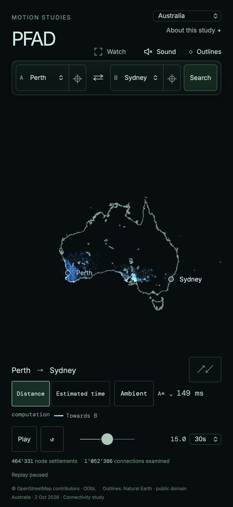

# Australia catalogue release · 3 October 2026

Australia joins the country selector with Perth–Sydney as its opening study,
39 curated places, mainland/Tasmania ambient regions, and independent coastline
and lake references. It selects the exact graph from the earlier
[sizing experiment](../australia-sizing-2026-10-03/README.md), with no change to
routing algorithms, topology, drawing simplification or resource guards.

| Measurement | Result |
| --- | ---: |
| Complete road download | 44,568,336 bytes |
| Optional OSM evidence | 17,656,782 bytes |
| Routing nodes | 2,819,540 |
| Physical edges / directed arcs | 3,498,445 / 6,153,801 |
| Drawing vertices | 13,605,504 |
| Outline coordinate layers | 260,133 bytes |
| Authored places | 39 |

The first selection asks for acknowledgement of the 44.6 MB road download and
substantial browser/graphics memory. The large-graph coarse-pointer policy uses
30 fps and DPR 1. These mitigations do not qualify physical phones.

[Source configuration](source-config.json) pins the 2 October Geofabrik source
at `2026-10-02T20:21:34Z`, provider MD5, measured SHA-256 and exact byte count.
[Road manifest](manifest.json) selects `au-20261002-72975ec9fdfa`, compiler
`pfad-study-compiler/3`, profile `road-connectivity-distance-v1` and the original
deterministic source identity. Turn, barrier and conditional tags remain evidence
under this profile. Ferries and non-motor-road classes are excluded. Data retains
OpenStreetMap attribution and ODbL obligations.

[Outline manifest](geography-manifest.json) selects
`geo-au-20261003-57a53084a64d`: 96 Natural Earth coastline rings and 31 lake
features, including salt lakes and unnamed features. Australia, Norfolk Island,
Coral Sea Islands and Ashmore/Cartier source polygons within the pinned coverage
bounds supply the outline. These generalized references never enter routing.

The [endpoint audit](manual-endpoints.json) checks every pair within the 35-place
mainland and four-place Tasmanian regions: 1,241 directed reachability checks,
reversal-stable snaps and snaps within 2 km. Nine directed studies compare all
four exact-distance algorithms, checking each chosen edge's adjacency, direction
and centimetre cost sum. Mainland–Tasmania explicitly returns no route.
The [ambient audit](ambient-audit.json) accepts sixty genuine journeys in 63
attempts, covering all 39 places, ten regional, 23 interregional and 27 national
journeys. The original 30/100/220 km bands and road-distance pacing remain intact.

Both the [local-byte app proof](local-browser-context.json) and the
[hosted-data app proof](hosted-browser-context.json) validate country selection,
three manual algorithms, seeking, shared-link reload, outline toggling, eight
real ambient studies, an automatic hold/fade transition and return to Switzerland.
Territory and greedy studies are part of this UI sequence. No browser errors or
bounded-attempt stops occurred. The local harness serves only exact candidate
bytes at their eventual public URLs; it is retained as
[local-browser-proof.mjs](local-browser-proof.mjs). The shared country proof now
uses the current custom algorithm menu.



[Road publication](publication.json) and [public delivery](delivery.json) cover
all 67 road objects. [Outline publication](geography-publication.json) and
[delivery](geography-delivery.json) cover all three context objects. Every public
object was checked for its exact checksum, CORS, immutable caching and opaque
gzip delivery. No existing release was overwritten.

The release is developed in an isolated worktree based on
`42e65291821918e9551f06f6fdfc1ec9d8079274`, preserving unrelated motorcar-profile
work in the primary checkout. `npm run check` passes typechecking, lint,
public package boundaries, 138 unit tests, the production build and artifact
budget; see [check log](check.log). All 78 browser cases passed: 39 Chromium
cases in the [initial suite](chromium-and-initial-webkit.log), and 39 touch-WebKit
cases in the [isolated WebKit suite](webkit-regression.log). The initial WebKit
navigation timed out while another WebKit proof overlapped; the complete isolated
rerun passed without an application change. The application bundle keeps the complete
Australian graph and outline coordinates in independent data hosting.

Physical-phone stability, author listening review and final music selection
retain their existing open status. The measured desktop sizing evidence is not
an internet-transfer or phone-memory guarantee.

To repeat the hosted normal-app proof from a built checkout:

```sh
node scripts/data/country-browser-proof.mjs au
```
