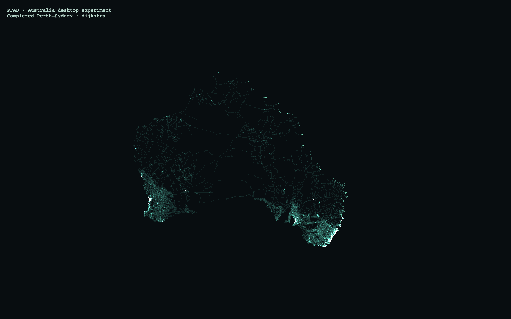

# Australia sizing and desktop feasibility

Australia compiles to **44,568,336 bytes (44.6 MB decimal)** for complete road
topology and drawing. It fits the existing application limits and passed long-distance
search and replay in Chromium Metal and desktop WebKit. This was a local candidate at sizing time. The subsequent
[catalogue release](../australia-release-2026-10-03/README.md) reuses these exact road bytes.

| Measurement | Result |
| --- | ---: |
| Dated source PBF | 966,233,948 bytes |
| Browser road download | 44,568,336 bytes in 65 chunks |
| Optional source evidence | 17,656,782 bytes |
| Routing nodes | 2,819,540 |
| Physical edges / directed arcs | 3,498,445 / 6,153,801 |
| Drawing vertices | 13,605,504 |
| Retained physical motor-road length | 973,880.331 km |
| Largest weak component | 2,705,657 nodes (96.0%) |
| Local opening, Chromium / WebKit | 0.745 s / 0.521 s |
| Measured search range | 0.127–0.823 s |
| Desktop replay | approximately 60 fps |

The road download excludes optional source evidence, outlines and music.
[Statistics](statistics.json) count retained physical edges once and describe weak
connectivity, which ignores travel direction. The selected motor-road classes
exclude tracks and ferries. The sparse interior is visible in the real search:



Each browser ran Perth–Sydney bidirectional Dijkstra twice, A*, Dijkstra, and
Darwin–Adelaide bidirectional Dijkstra. Each run included a 15-second replay and
forward/backward seeks. Perth–Sydney's shortest-distance cost was 3,767.34076 km;
Darwin–Adelaide's was 3,005.31959 km. All three Perth–Sydney algorithms agreed.
Repeated traces and all five corresponding cross-browser trace hashes matched;
geometry coverage and exact road IDs matched the manifest, and no page, console,
crash or WebGL errors occurred. [Summary](summary.json) and
[raw measurements](desktop-report.json) retain the results, algorithms,
deterministic tie-breaking and provenance.

Perth–Sydney A* settled 835,862 nodes, Dijkstra 1,912,851, and bidirectional
Dijkstra 2,588,467. Their maximum queues were 2,092, 1,027, and 1,555 entries.
Bidirectional search examined more nodes than Dijkstra for this pair; the sparse
corridors and dense urban networks are reflected in actual algorithm work.

Measurements used an Apple M4 Max with 36 GiB RAM, a 1440×900 viewport at DPR 1,
local serving and sequential browsers. Download latency is additional. Chromium's
sampled process-tree RSS peaked at approximately 1.56 GB; this is an approximate
observation, not a guaranteed memory requirement or a complete GPU-memory total.
WebKit helper processes escape this sampler, so its RSS must not be used as a
memory estimate. Playwright desktop WebKit does not qualify Safari or a physical
phone. The harness receives expanded drawing; the ordinary application may retain
compressed drawing. No capacity guard or production runtime was changed for this
experiment.

Source: [Geofabrik Australia](https://download.geofabrik.de/australia-oceania/australia.html),
`australia-261002.osm.pbf`, timestamp `2026-10-02T20:21:34Z`. The
[source record](source.json) pins exact size, MD5 and SHA-256. The
[manifest](manifest.json) pins compiler `pfad-study-compiler/3`, profile
`road-connectivity-distance-v1`, projection, chunks and identity
`72975ec9fdfa019f772f8ec7ae20ce91556f342d786ebe7ed871a286b4767f8e`.
Road costs preserve original lengths; the 5 m drawing simplification does not
change topology or costs. This connectivity profile retains turn, barrier and
conditional tags as evidence without enforcing them. OSM-derived data retains
OpenStreetMap attribution and ODbL obligations.

## Validation and reproduction

All immutable files passed checksum, decoded-layout and complete-coverage
verification with the publisher's dry run; see [verification](verification.json).
`npm run check` passed all 201 tests and the application build; see
[check log](check.log). These checks ran on the existing workspace, including
ongoing routing-profile changes; [context](context.json) records the checkout and
relevant file hashes. Sources and compiled graph chunks remain in ignored `.cache/`.

The retained [harness](desktop-proof.mjs) derives from the desktop-country proof.
It updates the country labels, captures the partial replay image, and checks seeks
against the current `replayFrame` contract, including the final route-reveal window.
The initial legacy assertion assumed a linear search-only timeline; correcting that
assertion required no application change.

With Python 3.11+ and the pinned `scripts/data/requirements.txt`,
`python scripts/data/build-country.py au` performs acquisition, source pinning,
full sizing variants and packaging without selecting a release. This run used
`size-proof.py --study-only`, which writes the same raw graph and 5 m geometry
needed by the packager while skipping other compression/simplification variants.
The measured [sizing report](sizing-report.json), [sizing log](sizing.log), and
[packaging log](packaging.log) retain byte counts and elapsed extraction time.

To reuse the measured sizing and replay the retained candidate:

```sh
python scripts/data/build-country.py au \
  --reuse-sizing .cache/countries-sizing/au-20261002
python scripts/data/publish-country.py \
  .cache/countries/au-20261002-72975ec9fdfa --dry-run
node docs/evidence/australia-sizing-2026-10-03/desktop-proof.mjs \
  .cache/countries/au-20261002-72975ec9fdfa/manifest.json \
  .cache/au-browser docs/evidence/australia-sizing-2026-10-03/journeys.json
```
