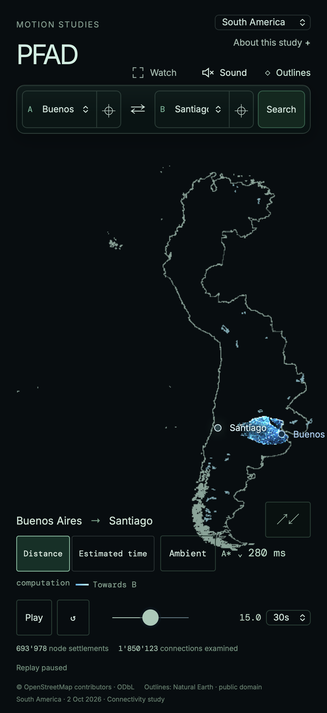

# South America nine-country release

South America (`sam`) selects nine complete same-time country extracts:
Argentina, Bolivia, Chile, Colombia, Ecuador, Paraguay, Peru, Uruguay and Venezuela.
Brazil, Guyana and Suriname are excluded. The earlier
[continental feasibility study](../south-america-sizing-2026-10-03/README.md)
measured eleven countries and demonstrated connections across these nine;
the full continent exceeds the current routing-node guard.

| Measurement | Nine-country release |
| --- | ---: |
| Complete road download | 143,123,558 bytes (143.124 MB decimal) |
| Routing nodes | 7,972,087 |
| Physical edges | 10,840,182 |
| Directed arcs | 19,985,956 |
| Drawing vertices | 49,835,302 |
| Author places | 37 |

All counts fit existing allocation guards. The opening journey is Buenos Aires–
Santiago. Selection uses the existing large-download acknowledgement. The complete
country extracts retain coastal islands, including Chile’s Easter Island, as real
separate components where roads do not connect. Ambient uses the validated
mainland places; no island or border connectors are invented.

## Source and routing

[Source configuration](source-config.json) pins all nine 2 October 2026 Geofabrik
extracts, with matching replication timestamp `2026-10-02T20:21:34Z`, exact input
bytes, independent SHA-256 and provider MD5. Osmium 1.19.1 / libosmium 2.23.1
merges whole extracts by OSM object identity without clipping; `check-refs` found
zero missing way-node references. The selected composite checksum is
`754b54356eb53b755b449fe000c3fa4b5514c56fc8775b049e8d113853a75aaa`.

The [manifest](manifest.json) pins compiler `pfad-study-streaming-compiler/1`,
profile `road-connectivity-distance-v1`, projection, 5 m drawing simplification,
source composition and all verified chunks. Original centimetre road costs and
topology are distinct from simplified drawing. Restrictions, barriers and
conditional access are retained as source evidence without enforcement; ferries
and tracks are excluded. This is a computation study, not navigation certification.
The newer enforced motorcar profile and physical phones remain unvalidated here.

Eight directed journeys from Buenos Aires reach cities in all other countries.
A*, Dijkstra and bidirectional Dijkstra agree on each exact centimetre cost.
Every route passes adjacency, one-way direction and cost-sum checks. Full forward
and reverse reachability proves all 37 authored points mutually reachable, with
snaps within 2 km. See [routing audit](audit.json) and
[place audit](places-audit.json).

[Ambient audit](ambient-audit.json) accepts 60 real journeys in 82 attempts,
using all four exact-distance journey algorithms: 11 regional, 25 interregional
and 24 national. Actual road distance decides acceptance; durations range from
25 to 65 seconds. The authored pool is `sam-places/1`.

## Map context and verification

[Geography manifest](geography-manifest.json) pins one joined nine-country
coastline/outer border and major lakes from the existing checksum-verified Natural
Earth snapshot. It includes Easter Island and retains complete shared-lake
polygons. Country polygons are dissolved before simplification. Map context stays
separate from topology and search events. Natural Earth is public domain;
OSM-derived graph data retains © OpenStreetMap contributors attribution and ODbL.

Every graph and geography object passed checksum, decoded-layout and complete
coverage validation before publication. [Road delivery](delivery.json) verifies
all 198 public objects; [geography delivery](geography-delivery.json) verifies all
three context objects, including CORS and immutable delivery headers. Manifests
were uploaded last; existing objects cannot be overwritten.

`npm run check` passed in the rebased release checkout; see
[check log](rebased-check.log). The application browser regression suite passed
all 78 checks. [App context](local-browser-context.json) checks the download
notice, three manual algorithms, shared-link restoration, outline visibility,
eight ambient studies, a real automatic transition and return to Switzerland
without errors or bounded-attempt stops.



 The dedicated desktop graph proof uses Chromium Metal and desktop
WebKit, loads every drawing vertex with exact road IDs, repeats Bogotá–Buenos
Aires bidirectional Dijkstra, compares A* and Dijkstra costs, and replays
Montevideo–Santiago. All corresponding cross-browser trace hashes agree, all seeks
preserve recorded event indices, and no page, console, crash or WebGL errors occur.
[Measurements](desktop-report.json) retain browser and hardware details.
Sequential desktop searches took 0.590–2.487 seconds. The long
Bogotá–Buenos Aires replays averaged 26.12–31.06 fps; Montevideo–Santiago
averaged 59.76–60.02 fps. The earlier eleven-country experiment ran faster
on the same host; these current measurements do not establish its cause or
guarantee a frame rate on another device. The 60 fps desktop target remains
unmet for the heaviest measured journey.

Desktop results use Apple M4 Max with 36 GiB RAM, 1440×900 at DPR 1 and local
serving. Network latency is additional. Process-tree RSS observations are
approximate and cannot establish total GPU/browser memory. Desktop touch WebKit
is regression evidence, not a physical-phone certification.

## Reproduction

Acquire the exact dated input files from `data/countries/sam.json` into ignored
`.cache/osm/`, then reproduce and verify the pinned union and release:

```sh
python scripts/data/prepare-composite-source.py sam
python scripts/data/build-streamed-study.py \
  --source .cache/osm/sam-261002.osm.pbf --country data/countries/sam.json \
  --output .cache/south-america-nine/packaged
node scripts/data/audit-south-america.mjs \
  .cache/south-america-nine/packaged/sam-20261002-c47bad2cdf2e/manifest.json
node scripts/data/audit-country-places.mjs sam \
  .cache/south-america-nine/packaged/sam-20261002-c47bad2cdf2e/manifest.json \
  .cache/south-america-nine/places-audit.json
node scripts/data/audit-ambient.mjs --country sam \
  --manifest .cache/south-america-nine/packaged/sam-20261002-c47bad2cdf2e/manifest.json
```

Move the compiler’s `build-report.json` outside the packaged release before the
publisher’s strict dry-run; only manifest-referenced immutable objects belong in
that directory. Rebuilding never replaces an existing release. Source PBFs and
graph chunks remain in ignored `.cache/`. [Tooling hashes](tooling.json) retain
the measured compiler and runtime sources.
