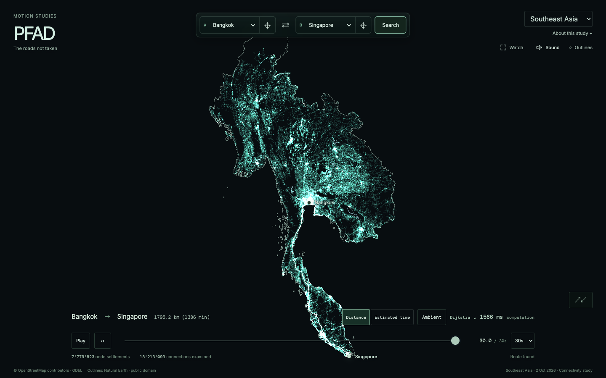

# Southeast Asia publication

PFAD selects the immutable six-country study covering Myanmar, Thailand,
Cambodia, Laos, Peninsular Malaysia and Singapore. Malaysian Borneo and Brunei
are excluded. The road download is **116.5 MB**, with **41.3 MB** optional source
evidence. The existing large-download acknowledgement shows the size and desktop
memory observation; physical-phone stability remains unverified.

Road release: `sea-20261002-eecf8c542fab`, identity
`eecf8c542fabeec3cd8ecf2e33bac7666764ea14390b34b478eb0cbaa66c356f`.
Geographic release: `geo-sea-20261003-36ee8b30792c`, 117,562 layer bytes.
The source date is 2 October 2026. The [original sizing report](../southeast-asia-sizing-2026-10-03/README.md)
retains compiler/profile versions, exact source inputs, directed cross-border
checks, full graph counts and desktop replay measurements. Data retains
© OpenStreetMap contributors attribution and ODbL; code remains MIT.

## Immutable delivery

The [road publication](publication.json) records 184 uploaded objects. Every
object was re-read through the public delivery Worker, including exact byte
length, SHA-256, CORS, immutable caching and opaque gzip-container checks; see
[road delivery](delivery.json). The [geographic publication](geography-publication.json)
and [delivery](geography-delivery.json) retain equivalent evidence for its three
objects. The manifest was uploaded after all data objects. Existing release keys
were checked rather than overwritten.

The delivery Worker permits bounded regional IDs of two to eight letters, with
dated content-identified paths and the existing restricted object names and
read-only methods. Tests cover both a two-letter country and the three-letter
region. Its deployed version is recorded in [context](context.json).

Geographic references use the existing pinned Natural Earth 1:10m sources.
Seventy dissolved exterior rings show the joined coastline and outer land
border; six major lake features provide independent context. The reference layer
has no routing or replay-event role. `package-geography.mjs --country sea` pins
only this new reference release without changing other countries' references.

## Journeys and browser checks

The versioned `sea-places/1` pool has 26 cities across the six countries.
Distance bands are 30–300 km, 300–1,000 km and 1,000 km or more. The
[ambient audit](ambient-audit.json) accepted 60 real journeys in 63 attempts,
covering all 26 cities. Exact route adjacency, direction, cost sums, distance-band
acceptance and algorithm identity were checked. Sound uses the existing original
Driftbox ambient repertoire.

`npm run check` passed in the integrated release checkout; see [log](check.log).
Country selection, outlines, ambient interaction and study regression checks
passed in both Chromium and mobile WebKit: 11 checks per engine. See
[Chromium log](chromium-regression.log) and [WebKit log](webkit-regression.log).
These mobile-viewport checks do not certify the regional graph on a physical
phone. The earlier WebKit navigation failures in the dirty sizing workspace did
not reproduce on the clean publication checkout.

The [actual release-UI check](local-browser-report.json) used Chromium and
desktop WebKit with the real published graph and geographic objects. No road
request occurred before consent. Both browsers loaded the complete graph,
verified the regional outline identity, rendered Bangkok–Yangon and the
1,795.2 km Bangkok–Singapore route, and completed a real ambient journey.
No page or console errors occurred.

The reusable [browser proof](browser-proof.mjs) checks a local built preview by
default; set `PFAD_URL=https://motionstudies.app/pfad/` for the hosted edition.
The ordinary GitHub Pages pipeline runs its required checks and publishes the
app build. Cloudflare then independently publishes that same successful Pages
artifact with the pinned Motion Studies hosting tools. Sources and generated
graphs remain in ignored `.cache/`; no downloads or data refresh schedules were
added. Existing recording identities remain valid.
