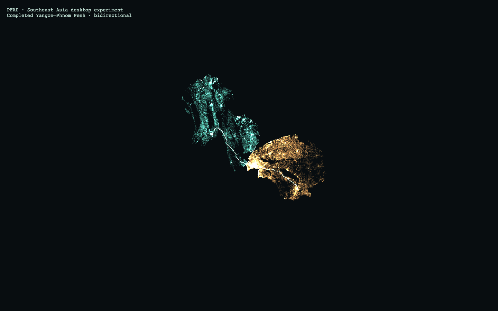

# Southeast Asia combined-area feasibility

The six-country regional candidate compiles to **116,507,200 road-download bytes
(116.5 MB decimal)** across 182 verified chunks. Coverage is Myanmar, Thailand,
Cambodia, Laos, Peninsular Malaysia and Singapore, including nearby islands;
Malaysian Borneo and Brunei are excluded. This report records the original local candidate. It was subsequently selected
and published; see [release evidence](../southeast-asia-release-2026-10-03/README.md). Sources and generated
road chunks remain in ignored `.cache/`.

| Measurement | Result |
| --- | ---: |
| Deduplicated and clipped source PBF | 895,646,029 bytes |
| Browser road download | 116,507,200 bytes |
| Optional source evidence | 41,325,022 bytes |
| Routing nodes | 8,085,252 |
| Physical edges / directed arcs | 9,827,240 / 18,783,168 |
| Drawing vertices | 36,849,592 |
| Retained physical motor-road length | 1,523,900.666 km |
| Largest weak component | 7,896,719 nodes (97.668%) |
| Weak components | 30,418 |

All counts fit the existing PFAD capacity guards. Download bytes exclude music,
outlines and optional source evidence. The earlier chat estimate of 26–60 MB
was too low: source PBF size alone did not predict this region's retained road
content. The result lies between the selected UK (92.4 MB) and Germany (140.9 MB)
datasets. Weak connectivity ignores travel direction and does not certify
navigability or universal cross-border connectivity.

## Source and road validation

The five input extracts are dated 2 October 2026 and share replication timestamp
`2026-10-02T20:21:34Z`. Each was checked against Geofabrik's MD5 and independently
pinned with SHA-256. [Source provenance](source.json) retains all input URLs,
bytes, hashes and composition details; [country configuration](../../../data/countries/sea.json)
is the reproducible local candidate pin.

Osmium 1.19.1 / libosmium 2.23.1 merges by OSM object identity before a
`complete_ways` extraction within `[92,1,108.7,29]`. This excludes Borneo and
Brunei while preserving source way geometry at the boundary. No separately
compiled graph concatenation or synthetic road connections are used.
`osmium check-refs` found zero missing way-node references. Actual retained road
bounds are `[92.13721,1.19164,107.82502,28.37876]`.

The [manifest](manifest.json) pins compiler `pfad-study-compiler/3`, profile
`road-connectivity-distance-v1`, projection, 5 m drawing tolerance and dataset
identity `eecf8c542fabeec3cd8ecf2e33bac7666764ea14390b34b478eb0cbaa66c356f`.
[Verification](verification.json) confirms checksums, decoded layout, manifest
identity and complete chunk coverage. Original costs and routing topology are
independent of simplified drawing. Turn restrictions, barriers and conditional
access remain source evidence rather than enforced rules in this connectivity
profile; tracks and ferries are excluded. This does not measure the newer
motorcar profile. OSM-derived data retains © OpenStreetMap contributors
attribution and ODbL obligations.

[Cross-border audit](audit.json) checks five directed journeys from Bangkok.
Every route passes adjacency, one-way direction, cost-sum and endpoint snap
checks. A*, Dijkstra and bidirectional Dijkstra agree on exact centimetre costs:

| Destination | Shortest-distance km |
| --- | ---: |
| Yangon | 809.972 |
| Phnom Penh | 622.874 |
| Vientiane | 622.380 |
| Kuala Lumpur | 1,449.283 |
| Singapore | 1,795.219 |

This establishes road connectivity across the six countries for these endpoints,
not every individual crossing or disconnected component. Algorithm versions,
deterministic tie-breaking, trace hashes and source identity are retained in the
audit. Singapore's city coordinate snaps approximately 601 m to a retained
motor road; all audited snaps are below 2 km.

## Reproduction

Use Python 3.11+ with `scripts/data/requirements.txt`, Node 24+ and the pinned
Osmium versions. Manually acquire the five dated inputs listed in the country
configuration into `.cache/osm/`, verifying their pinned sizes and hashes. The
composite preparation tool verifies these again. No ordinary build or CI job
acquires sources, and existing dataset identities remain unchanged.

```sh
python scripts/data/prepare-composite-source.py sea
python scripts/data/size-proof.py \
  --source .cache/osm/southeast-asia-261002.osm.pbf \
  --output .cache/countries-sizing/sea-20261002 \
  --provenance docs/evidence/southeast-asia-sizing-2026-10-03/source.json \
  --study-only
python scripts/data/build-country.py sea \
  --reuse-sizing .cache/countries-sizing/sea-20261002
python scripts/data/publish-country.py \
  .cache/countries/sea-20261002-eecf8c542fab --dry-run
node scripts/data/audit-sea-crossborder.mjs \
  .cache/countries/sea-20261002-eecf8c542fab/manifest.json
node docs/evidence/southeast-asia-sizing-2026-10-03/desktop-proof.mjs \
  .cache/countries/sea-20261002-eecf8c542fab/manifest.json \
  .cache/sea-browser \
  docs/evidence/southeast-asia-sizing-2026-10-03/journeys.json
```

The `--study-only` path writes the same graph and 5 m geometry needed by the
packager while skipping unrelated compression variants. [Sizing report](sizing-report.json),
[sizing log](sizing.log) and [packaging log](packaging.log) retain measurements.
[Workspace context](context.json) records existing routing-profile work and
relevant implementation hashes. No capacity guard or production runtime was
changed for this candidate. `npm run check` passed; see [check log](check.log).


## Desktop replay

Chromium Metal and desktop WebKit each ran Bangkok–Singapore bidirectional
Dijkstra twice, A*, Dijkstra, and Yangon–Phnom Penh bidirectional Dijkstra.
Every run included a 15-second replay and forward/backward seeks. All shortest
costs agreed, repeated traces matched, and all five corresponding cross-browser
trace hashes matched. Complete drawing coverage and exact road IDs matched the
manifest; no page, console, crash or WebGL errors occurred. See [summary](summary.json)
and [raw desktop report](desktop-report.json).

| Desktop measurement | Chromium Metal | WebKit |
| --- | ---: | ---: |
| Local complete-graph opening | 1.751 s | 1.921 s |
| Search range | 0.935–2.009 s | 0.825–1.960 s |
| Average replay fps across runs | 56.7–60.0 | 54.2–59.9 |

Bangkok–Singapore Dijkstra settles 7,779,823 nodes; A* and bidirectional counts
are retained in the raw report. The real exploration is visible at 35% of the
presentation timeline:


The completed Yangon–Phnom Penh bidirectional search shows the two recorded
fronts and resulting road route:



Measurements used an Apple M4 Max with 36 GiB RAM, 1440×900 viewport at DPR 1,
local serving and sequential browsers. Internet download latency is additional.
Chromium's sampled process-tree RSS peaked at approximately 2.18 GB; this is an
approximate observation, not a guaranteed requirement or complete GPU-memory
measurement. WebKit helper processes escape the sampler, so its RSS is not a
memory estimate. The harness receives expanded drawing; the ordinary app may
retain compressed drawing. Playwright desktop WebKit does not establish native
Safari or physical-phone support.


The application browser suite passed all 41 Chromium checks. Its WebKit mobile
project timed out in initial `page.goto` calls before producing a page snapshot;
three initial checks failed this way, and a focused retry after compilation
reproduced the navigation timeout on the algorithm-menu check. The runs were
stopped rather than repeating the same startup failure across the remaining
suite. See [initial application log](application-browser-check.log) and
[focused retry log](application-webkit-retry.log). The separate desktop WebKit
regional graph/search/replay harness passed all five runs. Those application checks used the then-dirty workspace. Focused Chromium and
mobile WebKit checks subsequently passed on the isolated release checkout; see
[release evidence](../southeast-asia-release-2026-10-03/README.md). Physical-phone
stability remains unverified.
