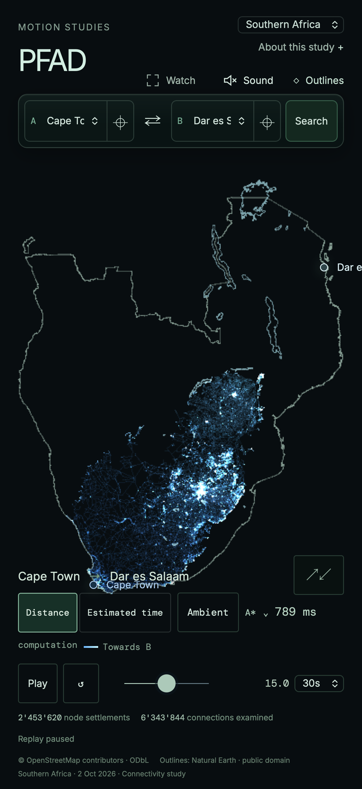

# Southern Africa catalogue release · 3 October 2026

Southern Africa adds **eleven countries**, including Tanzania, as one complete
road study: South Africa, Namibia, Botswana, Lesotho, Eswatini, Zimbabwe, Zambia,
Mozambique, Malawi, Angola and Tanzania. The opening journey is Cape Town–Dar es
Salaam. The release has 44 mainland places, an ambient pool, joined outer borders
and coastlines, and major lake references. No capacity guard is increased.

| Measurement | Result |
| --- | ---: |
| Complete road download | 110,680,420 bytes (110.7 MB decimal) |
| Optional OSM evidence | 31,361,504 bytes |
| Routing nodes | 6,249,625 |
| Physical edges / directed arcs | 8,256,124 / 16,160,825 |
| Drawing vertices | 39,604,500 |
| Physical motor-road length | 2,128,968.750 km |
| Outline coordinate layers | 174,889 bytes |
| Authored mainland places | 44 |

The [ten-country baseline](../southern-africa-sizing-2026-10-03/README.md) is
80.3 MB, with 4.67 million nodes and 28.17 million drawing vertices. Tanzania adds
30.3 MB, 1.58 million routing nodes and 11.43 million drawing vertices. The enlarged
area remains below the UK in routing nodes and below Germany in download and
node count; drawing vertices exceed Germany's 32.95 million, so complete drawing
and replay were measured rather than inferred from source PBF size.

All inputs share the replication timestamp `2026-10-02T20:21:34Z`. The
[source configuration](source-config.json) pins each exact Geofabrik URL, bytes,
provider MD5 and SHA-256. The deduplicated union is 2,339,893,968 bytes. Osmium
1.19.1 / libosmium 2.23.1 merges complete extracts by OSM object identity without
clipping or concatenating compiled graphs. The standard preparation script
[reproduces the pinned source checksum](composite-reproduction.log), and no way
node references are missing. Zanzibar and other extract islands are retained;
ferry-only roads remain separate components and are not ambient destinations.

The [road manifest](manifest.json) selects `sa-20261002-a9718f49cf14`, compiler
`pfad-study-streaming-compiler/1`, and `road-connectivity-distance-v1`. It retains
full composite provenance, projection, geometry tolerance and chunk hashes.
Original road lengths and direction determine route cost; 5 m drawing
simplification does not change topology. Turn restrictions, barriers and
conditional access remain source evidence under this basic connectivity profile.
This is not an enforced motorcar-profile release. OSM-derived data retains ODbL
and © OpenStreetMap contributors attribution.

The [endpoint audit](manual-endpoints.json) verifies reversal-stable snaps within
2 km for all 44 places. Directed reachability both to and from one Cape Town node
proves mutual reachability for every authored pair. Ten directed capital journeys
from Pretoria, including Dodoma, compare A*, Dijkstra and bidirectional Dijkstra:
exact costs agree, and every chosen edge passes adjacency, one-way direction and
centimetre cost-sum checks. See [cross-border audit](crossborder.json). The largest
weak component contains 98.081% of nodes; weak connectivity alone ignores direction.

The [ambient audit](ambient-audit.json) accepts sixty real journeys in 62 attempts,
covering 43 of the 44 authored places in this seeded sample. Every place is covered
by the separate directed endpoint audit. The regional/interregional boundaries
are 200/650 km, with the existing 30 km minimum and actual-road-distance acceptance
and replay pacing. The three accepted bands contain 10, 24 and 26 journeys.

[Desktop measurements](desktop-report.json) cover complete topology/drawing in
Chromium Metal and desktop WebKit, at 1440×900 and DPR 1 on an Apple M4 Max with
36 GiB RAM. Local opening took 1.291/1.486 seconds. Each engine ran Cape Town–Dar
es Salaam bidirectional Dijkstra twice, A*, Dijkstra, and Luanda–Mwanza
bidirectional Dijkstra, with a 15-second replay and forward/backward seeks each
time. Searches took 0.577–1.431 seconds and replay averaged 59.87–60.06 fps.
All corresponding cross-browser trace hashes match; repeated traces match; all
geometry vertices and road IDs are covered. No browser or WebGL errors occurred.
Cape Town–Dar es Salaam is 4,485.62012 km and Luanda–Mwanza is 3,850.84464 km under
this shortest-distance profile. Network download latency is additional.

The [normal-app local-byte proof](local-browser-context.json) and
[hosted-data proof](hosted-browser-context.json) validate country
selection and acknowledgement, three manual algorithms, exact seeking, shared-link
reload, outline toggling, eight real ambient studies including three-source
Dijkstra and greedy search, an automatic algorithm transition and return to
Switzerland. No browser errors or bounded-attempt stops occurred. The
[local harness](local-browser-proof.mjs) serves exact candidate bytes at their
eventual public URLs.



The first selection requires acknowledgement of the 110.7 MB download and
substantial browser/graphics memory. The existing coarse-pointer policy caps
rendering at 30 fps and DPR 1. Desktop and touch-viewport checks do not establish
physical-phone memory or native Safari support.

The [outline manifest](geography-manifest.json) selects
`geo-sa-20261003-2544fab79734`: twelve dissolved Natural Earth outer coastline/border
rings and twenty lake features. The eleven country polygons are joined before
simplification; internal political borders do not enter routing or divide the
study. Generalized lake references include Malawi, Tanganyika, Victoria, Kariba
and Cahora Bassa. Whole lake shorelines may extend outside the selected countries.

`npm run check` passes typechecking, lint, public-package boundaries, unit tests,
the production build and the existing artifact budget; see [check log](check.log).
The release was rebased onto the concurrent Southeast Asia addition before
deployment; [the subsequent full check](rebased-check.log) also passes with both
regional entries and all geographic references retained.
Source graphs and independent geography coordinates remain outside the app
artifact. The release is prepared in an isolated checkout of the existing main
branch, preserving unrelated working-tree changes and the already published
Australia study. Music and routing algorithms are unchanged.

[Road publication](publication.json) and [public delivery verification](delivery.json)
cover all 152 road objects. [Geography publication](geography-publication.json)
and [delivery verification](geography-delivery.json) cover all three context
objects. Checksums, CORS, immutable caching and opaque gzip delivery match the
local candidate for every object. Existing immutable releases were not replaced.
Three relevant Chromium country-switching and geography regression cases pass;
see [browser regression log](browser-regression.log).

To reproduce the pinned source and build manually, acquire the exact inputs
listed in `data/countries/sa.json` into ignored `.cache/osm/`, then run:

```sh
python scripts/data/prepare-composite-source.py sa
python scripts/data/build-streamed-study.py \
  --source .cache/osm/southern-africa-tanzania-261002.osm.pbf \
  --country data/countries/sa.json --output .cache/countries
```

The archived proof scripts run from `.cache/sa/` with repository-relative imports.
The selected manifest adds the complete source/coverage record from the config to
the unchanged chunk/projection/profile identity. Publication uses the verified
road-only release directory, excluding the compiler's separate build report.
